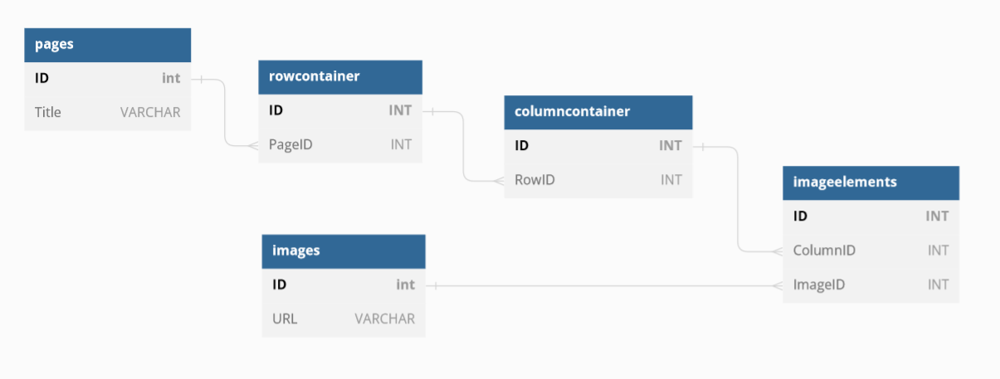

# Page Service
A REST API service for managing elements on a page

## Run
- Clone the repository
- Open the terminal in the cloned directory
- Run the below command:
```
docker-compose up
```
Wait for the app to run and then open [http://localhost:8080/api/v1/images](http://localhost:8080/api/v1/images) to check it.

Use the [Postman API collections](api_collections) to consume APIs.

> You can also run locally using `npm install && npm start` command

## Test
Run the below command in the repository directory:
```
docker-compose -f docker-compose-test.yml up
```

> or test locally using `npm test` command.

## Develop

```
npm run serve
```

## Architecture
This service allows you to create dynamic pages. Each page can have several `Rows` and inside each row, you can have several `Columns`. Inside columns, you can add `elements` like Images, Texts, Quote, etc. (Currently, only the Image element is implemented).

### Technologies
 - NodeJs
 - [Express](https://expressjs.com/)
 - MySQL
 - [Mocha](https://mochajs.org/) + [Chai](https://www.chaijs.com/) for testing
 - [StandardJS](https://standardjs.com/) + [Flow](https://flow.org/) for linting type checking


The following database scheme is used to store the hierarchy of pages.



There is an independent `Images` entity where users can add images and use them in image elements.
Database constraints are used to prevent the deletion of images if they are in use on a page.

### How To Improve
This design allows customizing `Rows`, `Columns` and `elements` independently and making them reusable (for example in a templating feature). But retrieving data is expensive because it requires multiple joins. With the growth of page elements, the performance will decrease.

We can improve this design using denormalizing the data and therefore reducing the number of SQL joins. But another good solution would be using a non-relational database like MongoDB.
In MongoDB we can store the whole page as a single document and avoid heavy traditional SQL queries.
Using MongoDB also simplifies the application because the page data is unified and saved in one place.

## TODO
I would do the following if I could find some time:
- Use [sequelize](https://www.npmjs.com/package/sequelize) ORM and remove manual SQLs to increase reliability, readability, and maintainability
- Allow uploading images and storing them in AWS S3 or locally (in [MinIo](https://min.io/) for example)
- Use validator libraries like [express-validator](https://www.npmjs.com/package/express-validator)
- Complete the tests
- Develop UI
- Handle all database constraint errors
- Use MongoDB instead of a relational database